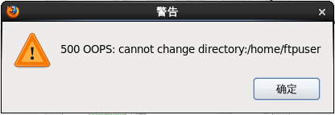
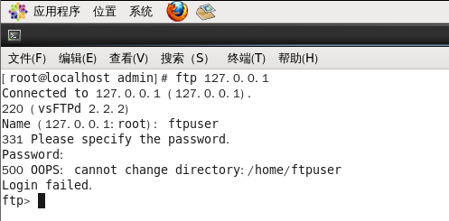
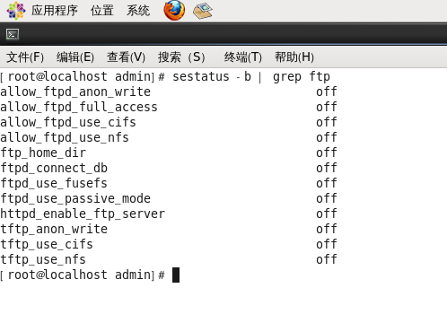
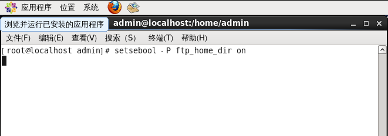
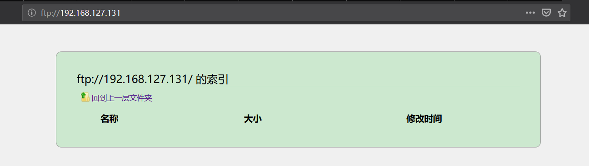
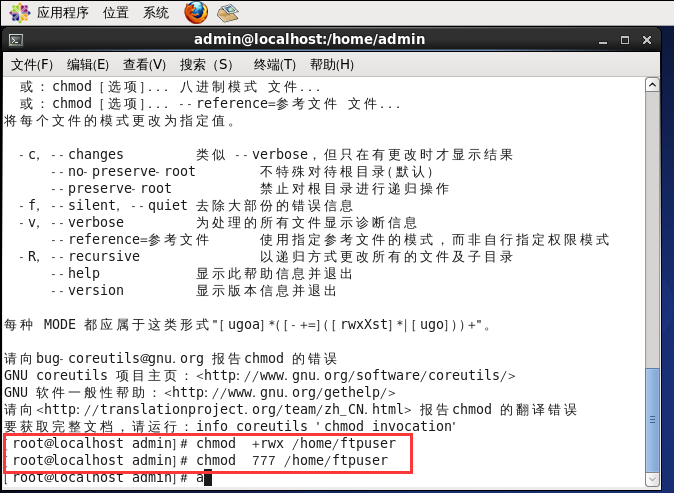

# 在Linux中配置FTP
> 配置好FTP后如何创建一个用户
```
  //创建一个用户
  useradd 用户名 -s /sbin/nologin
  //设置用户密码
  passwd 用户名
  密码：
  确认密码：
```

> 配置好FTP后客户端访问受到限制如何解决（报错：can not change directory）
* 在浏览器上访问



* 在命令行中访问


可以看到在命令行也是报同样的错误

1. 首先我们需要先在命令行查看该ftp的状态

    使用命令：`sestatus -b | grep ftp` 效果如下图所示



2. 在上图中我们可以很清晰的看到`ftp_home_dir off`

3. 修改如上off为no，使用代码`setsebool -P ftp_home_dir on`

 * 使用命令行输入
 

 * 使用`sestatus -b | grep ftp`查看状态是否改变
 

 4. 重启vsftpd `service vsftpd restart`
 

 5. 测试是否可以正常访问ftp服务
 

* 还有一种情况也会导致出现以上的错误(can not change directory) 就是当前用户没有权限访问该目录，这时使用`chmod`命令设置访问权限就OK了

