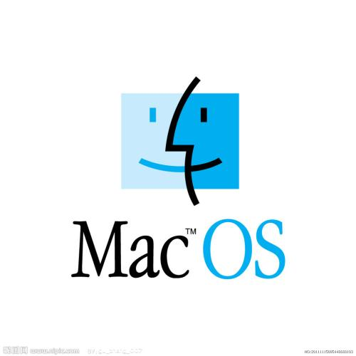
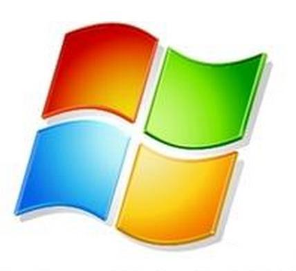
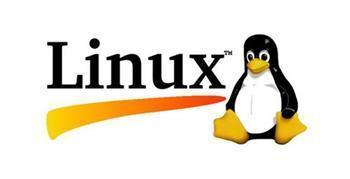
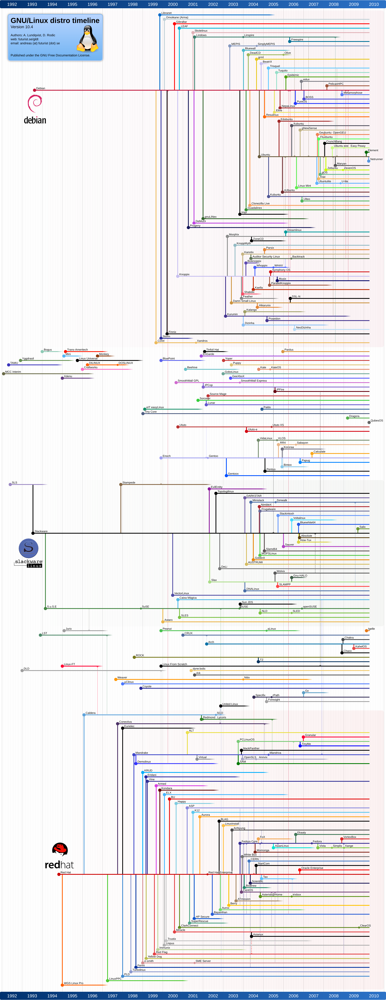

># Linux入门
> ### 1.1 Linux操作系统
 * 操作系统概述
    
    操作系统（Operating System，简称OS）通俗来讲就是一款软件。不过和一般的软件不同，操作系统时管理和控制计算机硬件与软件资源的计算机程序，是直接运行在“裸机”上的最基本的系统软件。`任何其它软件都必须在操作系统的支持下才能运行`

> ### 1.2 操作系统的分类

操作系统可以按：`应用领域`、`所支持用户数`、`源码开放程度`这几个方面进行分类

1. **按照应用领域分类**
    
* 桌面操作系统

    `桌面操作系统顾名思义就是具有图形化界面的操作系统。`在桌面操作系统诞生之前，最有名的操作系统就是DOS，但是DOS的操作界面十分不友好，仅仅是代码而已。`为此微软公式推出了第一个图形界面操作系统Windows 1.0`，直到今天`Max OS`、`Windows`、`Linux`形成了三足鼎立的局面。  

    
    
    

* 服务器操作系统

    `服务器操作系统指的是安装在大型计算机上的操作系统`。相对于桌面操作系统，服务器操作系统`要承当额外的管理、配置、稳定、安全保证等功能。`
    
    目前具有代表性的服务器操作系统有`Windows Server`、`Netware`、`UNIX`、`Linux`。

* 嵌入式操作系统

    嵌入式操作系统是一种用途广泛的系统软件，通常包括与硬件相关的底层驱动软件、系统内核、设备启动接口、通信协议、图形界面、标准化浏览器等。

    目前具有代表性的嵌入式操作系统有`嵌入式实时操作系统μC/OS-ll`、`嵌入式Linux`、`Windows Embedded`、`VxWorks`，以及应用在智能手机和平板电脑上的`Android`、`iOS`等。

2. **按照所支持用户数分类**

    根据在同一时间使用计算机用户的多上，操作系统可分为单用户操作系统和多用户操作系统。

* 单用户操作系统

    单用户操作系统是指一台计算机在同一时间只能由一个用户使用，一个用户独享系统的全部硬件和软件资源。

    目前具有代表性的单用户操作系统有`MSDOS`、`OS/2`、`Windows`。

* 多用户操作系统

    同一时间允许多个用户同时使用计算机，则称为多用户操作系统。

    目前具有代表性的多用户系统有`UNIX`、`Linux`、`MVS`。

3. **按照源码开发程度分类**

* 开源操作系统

    开源操作系统（Open Source Operating System），就是公开源代码的操作系统。可以遵循开源协议（GNU）进行使用、编译和再发布。在遵守GNU协议的前提下，任何人都可以免费使用。随意控制软件的运行方式。

    目前具有代表性的开源操作系统有`Linux`、`FreeBSD`。

* 闭源操作系统

    闭源操作系统和开源操作系统相反，指的是不开放源码的操作系统。

    目前具有代表性的闭源操作系统有`Mac OS X`、`Windows`。

> ### 1.3 Linux操作系统简介
在分类繁多的操作系统中Linux以其`稳定`、`小巧`、`易操作`，`大多版本免费`等特点占据着服务器操作系统领域的半壁江山。

1. **Linux的诞生**
    
    Linux的前身是UNIX，Linux诞生与1991年，是当时一名叫林纳斯·托瓦茨 的大学生为了翻遍自己访问大学主机上的新闻和邮件，自己编写了磁盘驱动程序和文件系统，这些也就是Linux的雏形。在自由软件之父理查德·斯托曼某些精神的感召下，林纳斯很快以Linux的名字把这款类UNIX的操作系统加入到了自由软件基金（FSF）的GNU计划中。这也造成了现在Linux发行版诸子百家的形态。因为任何人只要遵循GUN开源协议，就可以下载到Linux内核代码进行编写，而这些编写过的Linux就会拥有不同的版本名称。

    Linux并不是被刻意创造的，它完全是日积月累的结果，是经验、创意和一小段一小段代码的集合体。

2. **Linux的版本**

* RedHat系列

    Readhat系列，它包括`RHEL`（Redhat Enterprise Linux，收费版本）、`Fedora Core`（由Redhat桌面版本发展而来，免费）、`CentOS`（RHEL的社区克隆版，免费）。在稳定性方面，RHEL和CentOS的稳定性非常好，适合于服务器使用；但是Fedora Core的稳定性较差，一般应用于桌面应用。

* Debian系列

    Debian系列包括Debian和Ubuntu等。Debian是社区类Linux的典范、也最遵守GUN规范。Debian分为三个分支：stable、testing和unstable。其中，unstable为最新版本，有相对较多的bug，适合桌面用户。testing的版本都经过测试。相对较为稳定。而stable一般只用于服务器，软件包大都比较过时，但是稳定性和安全性都很高。Debian最具特色的是apt-get/dpkg包管理方式。

* Ubuntu系列

    Ubuntu严格来说不能算一个独立的发行版本，Ubuntu是基于Debian的unstable版本加强而来的，可以说Ubuntu是一个拥有Debian所有优点，以及自己所加强的优点的近乎完美的Linux桌面操作系统。它的特点是界面非常友好、容易上手，对硬件的支持非常全面，是最适合做桌面操作系统的Linux发行版。
