># Linux操作系统的安装
为了模拟企业中的真实开发环境，我们可以使用虚拟机安装Linux系统并配置Linux服务器。

1. **安装环境**

    虚拟机（Virtual Machine）值的是运行在某一个操作系统（如Windows）之上模拟完整硬件系统功能的软件。进入虚拟机后，所有操作都是在这个全新的、独立的虚拟系统里面进行，可以独立安装系统、运行软件、保存数据。

    常用的虚拟机软件有VirtualBox、Vmware workstation、Virtual PC等。

    在安装虚拟机之前，我们需要确认本机bios选型中，Virtualization（虚拟化）为enable状态。

    注意：
        
    Virtualization是bios选项中的一项，Virtualization开启代表本机支持虚拟化操作，反之则不支持。bios中Virtualization设置的路径为bios-->secirity-->Virtualization。

2. **CentOS安装**

    * 下载并安装VMware Workstation 12
    
    [VMware Workstation12百度网盘--下载 提取码：6al3](https://pan.baidu.com/s/1FrbMNuE6lH8YDR36I1npQg)

    1. 打开安装程序

    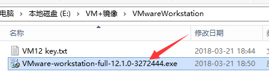

    2. 进行下一步开始安装

    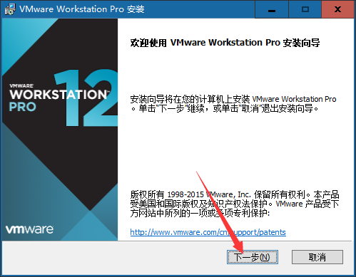

    3. 同意许可协议

     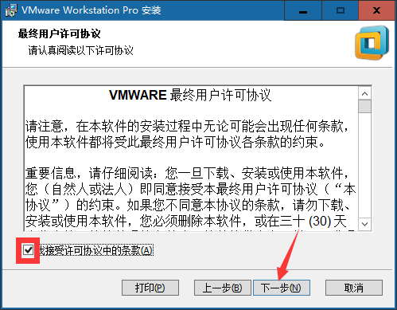

    4. 根据需要决定是否需要更改软件的安装位置

     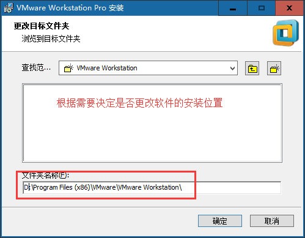

    点击下一步：

     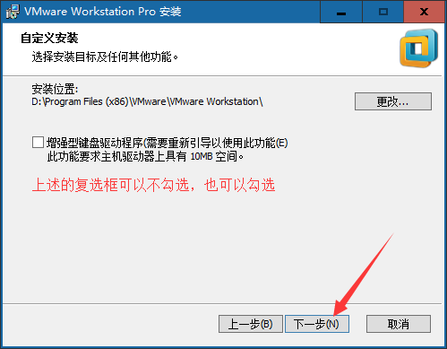

    5. 用户体验设置

     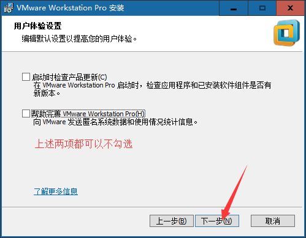

    6. 快捷方式创建的步骤

     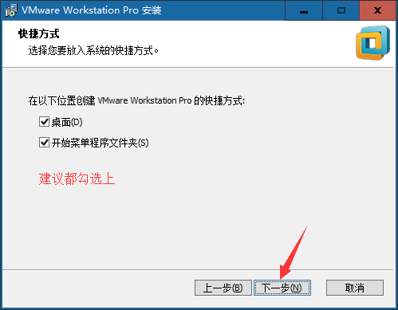# Linux操作系统的安装
为了模拟企业中的真实开发环境，我们可以使用虚拟机安装Linux系统并配置Linux服务器。

1. **安装环境**

    虚拟机（Virtual Machine）值的是运行在某一个操作系统（如Windows）之上模拟完整硬件系统功能的软件。进入虚拟机后，所有操作都是在这个全新的、独立的虚拟系统里面进行，可以独立安装系统、运行软件、保存数据。

    常用的虚拟机软件有VirtualBox、Vmware workstation、Virtual PC等。

    在安装虚拟机之前，我们需要确认本机bios选型中，Virtualization（虚拟化）为enable状态。

    注意：
        
    Virtualization是bios选项中的一项，Virtualization开启代表本机支持虚拟化操作，反之则不支持。bios中Virtualization设置的路径为bios-->secirity-->Virtualization。

2. **CentOS安装**

    * 下载并安装VMware Workstation 12
    
    [VMware Workstation12百度网盘--下载 提取码：6al3](https://pan.baidu.com/s/1FrbMNuE6lH8YDR36I1npQg)

    1. 打开安装程序

    

    2. 进行下一步开始安装

    

    3. 同意许可协议

     

    4. 根据需要决定是否需要更改软件的安装位置

     

    点击下一步：

     

    5. 用户体验设置

     

    6. 快捷方式创建的步骤

     

    7. 点击安装按钮

     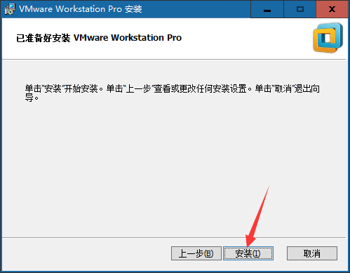

    8. 点击完成

     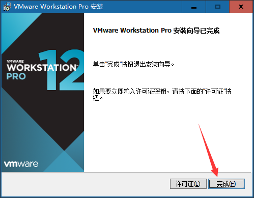

    9. 最重要的地方，在安装完之后需要检查，检查虚拟机软件是否有安装2个虚拟网卡

     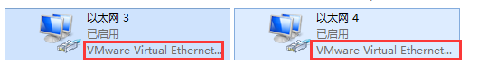

    如果没有这2个网卡的话，则会影响后期windows系统与虚拟机其中操作系统之间的相互通信（比如共享网络、文件传输等）。

    * 新建CentOS虚拟机系统
    
    1. 在VMware中的菜单栏中找到“文件”一项，点击菜单项中的“新建虚拟机”，选择自定义（高级）类型配置。

    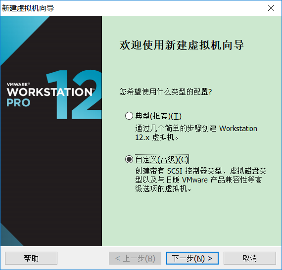

   2. 点击下一步，进入 选择新建虚拟机类型

      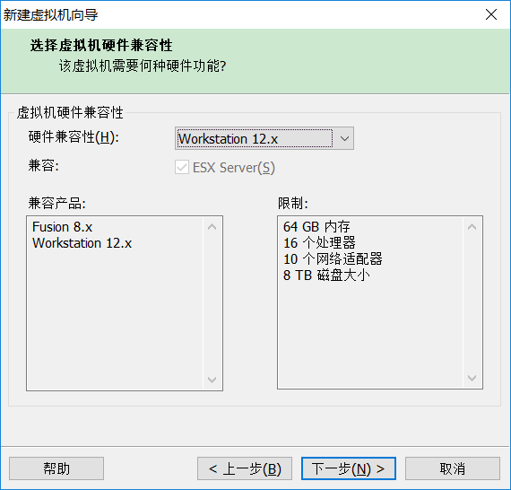

    3. 选择下载好的系统映像文件（ISO文件）[CentOS6.5 系统下载链接 提取码：o3o7](https://pan.baidu.com/s/1FzOA3bYQLkpUwDlDQuycRw).

      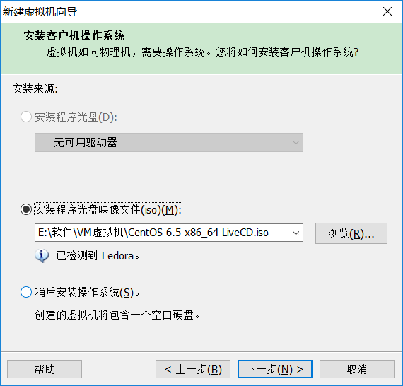

    4. 选择安装位置，并对虚拟机命名。

      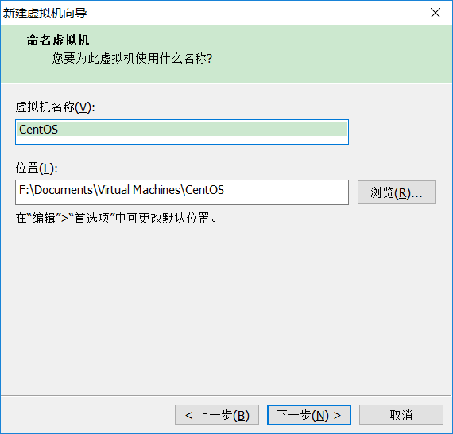

    5. 配置虚拟机的处理器个数。

      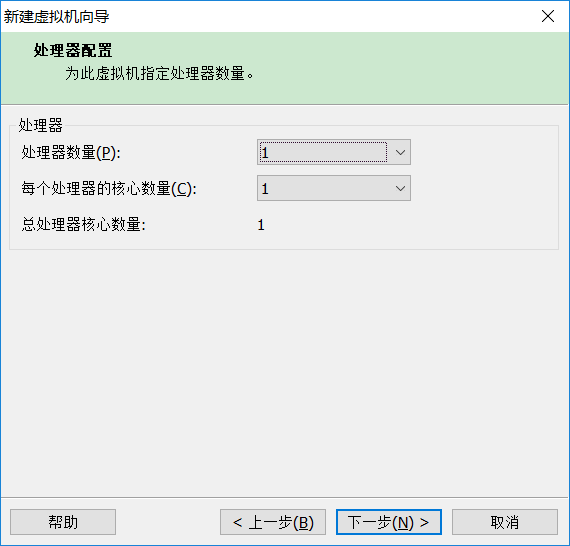

    6. 设置虚拟机的内存，根据自身电脑的配置设置。 

      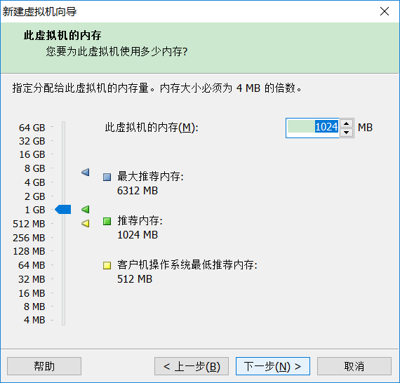

    7. 设置网络类型。

      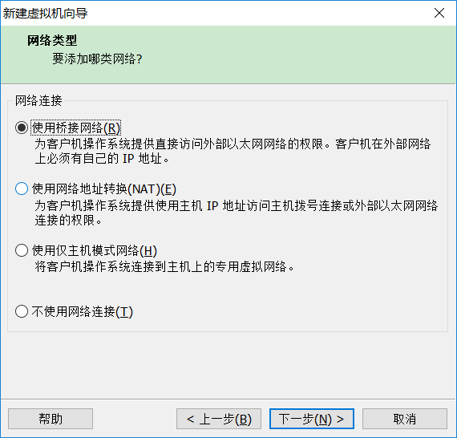
    
    ```
    桥接方式模式（bridged）下VMware虚拟出来的操作系统，和宿主机处于同一个局域网中，他可以访问宿主机所在网内任何一台机器。宿主机所在局域网内其他主机，也可以访问虚拟出来的操作系统。

    网络地址转换模式（NAT）下VMware虚拟出来的操作系统之间（如果虚拟出来的操作系统有多个）处于同一个局域网中，但是虚拟出来的操作系统本身和宿主机不在同一个局域网中。虚拟出来的操作系统无法访问宿主机所在局域网内除宿主外的其他主机。其他主机也不能访问虚拟主机。
    ```
    
    8. 设置I/O控制器的类型

      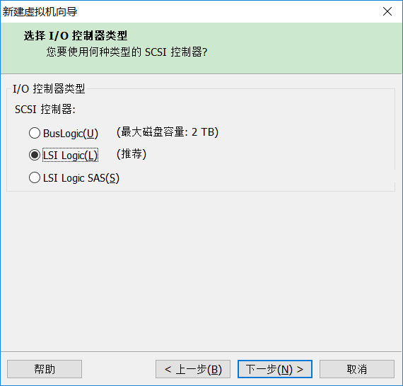

    9. 设置虚拟机的磁盘类型

      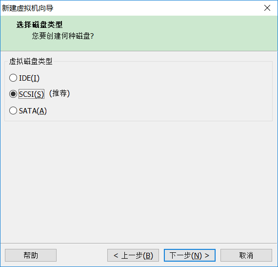

    10. 选择磁盘使用类型

      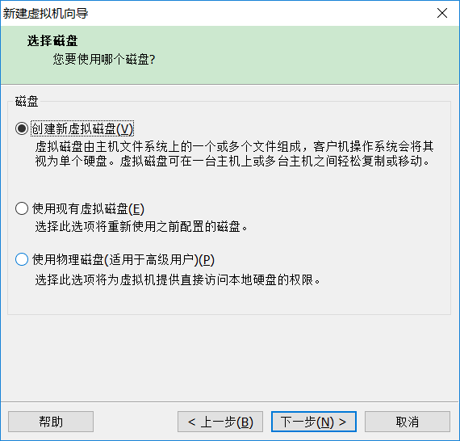
    
    11. 设置虚拟机的磁盘大小

      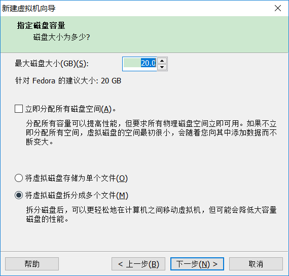

    12.指定虚拟磁盘文件 

      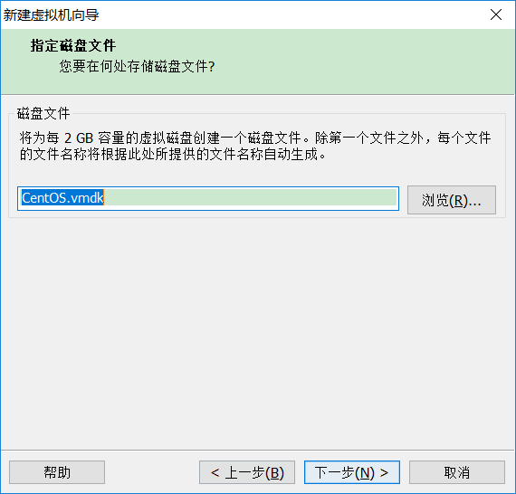

    13.点击完成，虚拟机就创建完毕了。 

      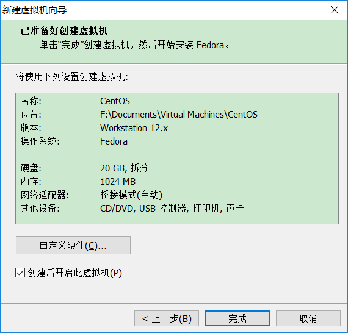

    14.虚拟机系统桌面。 

      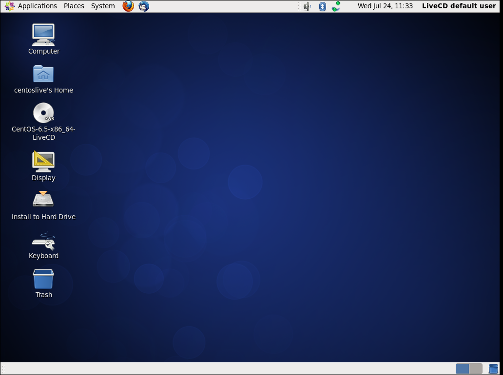

    15.在菜单栏中找到 终端（命令行） 

      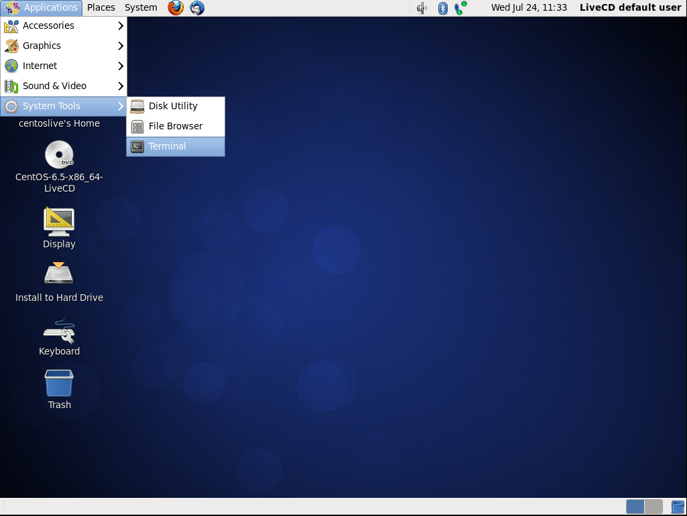

    16. 设置root（系统超级管理员的密码）

      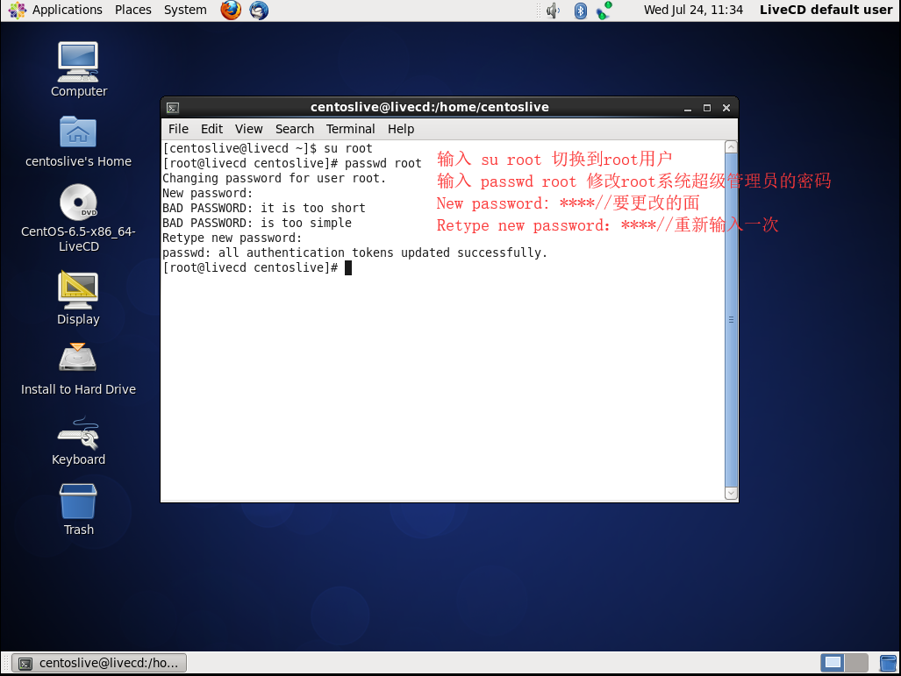

    17. 点击桌面上的图标，将系统装入虚拟磁盘中。

      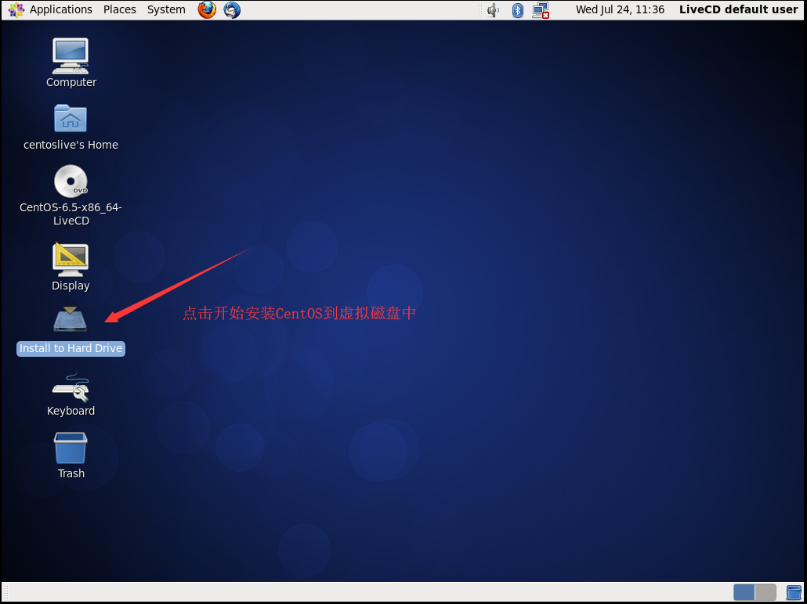

    18. 输入root用户密码，进入安装引导界面后，按照自己的需求配置即可。CentOS等引导全部结束便会安装完毕。

      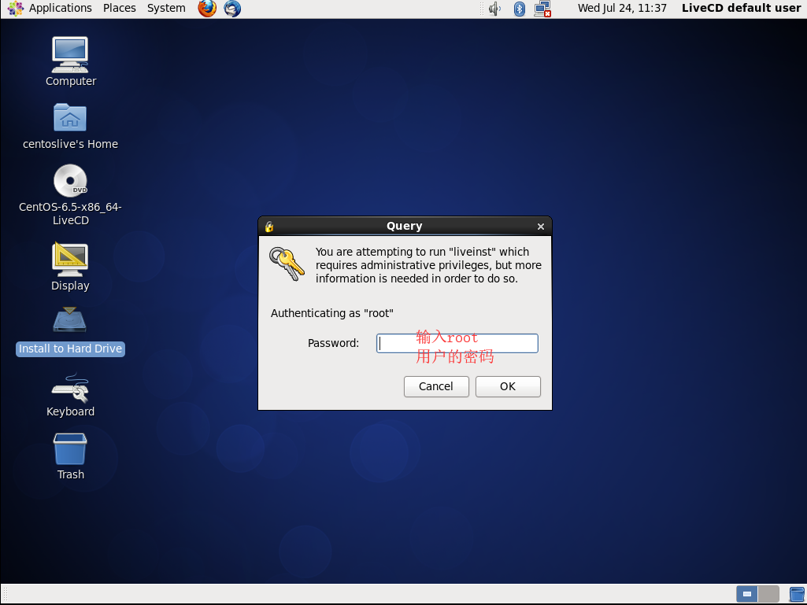
    
># Linux文件系统

* 目录和分区

    * 完成Linux操作系统按安装，并成功启动系统后，使用安装时输入的用户名密码进行登录。登录成功后，系统将展示CentOS的桌面。

    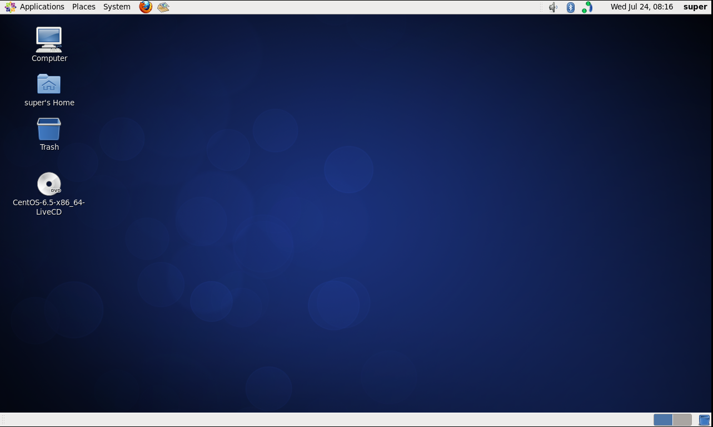

    * 双击“Computer”图标，打开Computer窗口。

     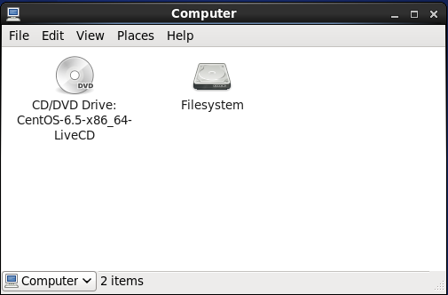

    * 其中“Filesystem”是系统文件系统目录结构的快捷方式。双击进入，我们将看到系统的一级目录。

    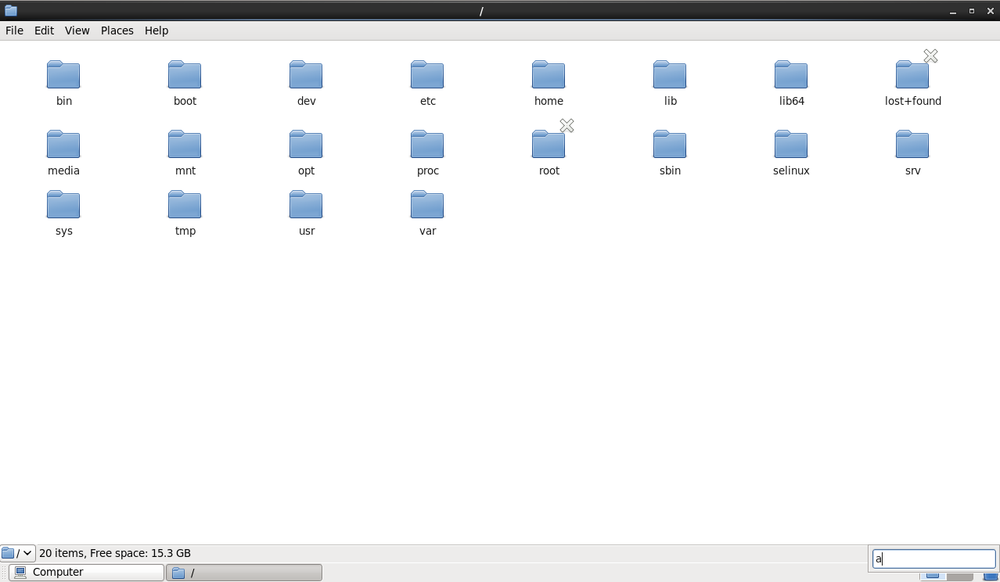

    * 在Linux操作系统中所有的设备包括软件、硬件、文档都属于文件。如一块cpu、一个内存条或者一块磁盘。双击进入dev目录，可以看到本机中的硬件，每一个硬件都被当做文件，存在于dev目录下。

    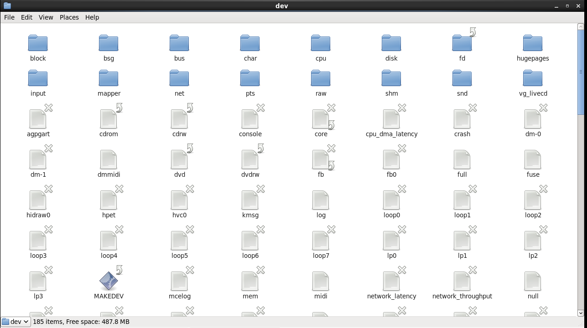

* 常用目录介绍

    * /var 包含在正常操作中被改变的文件：假脱机文件、记录文件、加锁文件、临时文件和页格式化文件等。

    * /home 包含用户的文件：参数设置文件、个性化文件、文档、数据、EMAIL、缓存数据等，系统每增加一个用户，系统就会根据其用户名在home目录下新建和其用户名同名的文件夹，用于保存其用户配置。

    * /proc 包含虚幻的文件：他们实际上并不存在与磁盘上，也不占用任何空间。（用ls -l可以显示它们的大小）当查看这下文件时，实际上是在访问存在内存中的信息，这些信息用于访问系统。

    * /bin 包含系统启动时需要的执行文件（二进制），这些文件可以被普通用户使用。

    * /dev 为设备文件目录。Linux下设备被当成文件，这样一来硬件被抽象化，便于读写、网络共享以及需要临时装载到文件系统中。正常情况下，设备会有一个独立的子目录。这些设备的内容会出现在独立的子目录下。创建的步骤"/>

    7. 点击安装按钮

     

    8. 点击完成

     

    9. 最重要的地方，在安装完之后需要检查，检查虚拟机软件是否有安装2个虚拟网卡

     

    如果没有这2个网卡的话，则会影响后期windows系统与虚拟机其中操作系统之间的相互通信（比如共享网络、文件传输等）。

    * 新建CentOS虚拟机系统
    
    1. 在VMware中的菜单栏中找到“文件”一项，点击菜单项中的“新建虚拟机”，选择自定义（高级）类型配置。

   

   2. 点击下一步，进入 选择新建虚拟机类型

      

    3. 选择下载好的系统映像文件（ISO文件）[CentOS6.5 系统下载链接 提取码：o3o7](https://pan.baidu.com/s/1FzOA3bYQLkpUwDlDQuycRw).

      

    4. 选择安装位置，并对虚拟机命名。

      

    5. 配置虚拟机的处理器个数。

      

    6. 设置虚拟机的内存，根据自身电脑的配置设置。 

      

    7. 设置网络类型。

      
    
    ```
    桥接方式模式（bridged）下VMware虚拟出来的操作系统，和宿主机处于同一个局域网中，他可以访问宿主机所在网内任何一台机器。宿主机所在局域网内其他主机，也可以访问虚拟出来的操作系统。

    网络地址转换模式（NAT）下VMware虚拟出来的操作系统之间（如果虚拟出来的操作系统有多个）处于同一个局域网中，但是虚拟出来的操作系统本身和宿主机不在同一个局域网中。虚拟出来的操作系统无法访问宿主机所在局域网内除宿主外的其他主机。其他主机也不能访问虚拟主机。
    ```
    
    8. 设置I/O控制器的类型

      

    9. 设置虚拟机的磁盘类型

      

    10. 选择磁盘使用类型

      
    
    11. 设置虚拟机的磁盘大小

      

    12.指定虚拟磁盘文件 

      

    13.点击完成，虚拟机就创建完毕了。 

      

    14.虚拟机系统桌面。 

      

    15.在菜单栏中找到 终端（命令行） 

      

    16. 设置root（系统超级管理员的密码）

      

    17. 点击桌面上的图标，将系统装入虚拟磁盘中。

      

    18. 输入root用户密码，进入安装引导界面后，按照自己的需求配置即可。CentOS等引导全部结束便会安装完毕。

      
    
># Linux文件系统

* 目录和分区

    * 完成Linux操作系统按安装，并成功启动系统后，使用安装时输入的用户名密码进行登录。登录成功后，系统将展示CentOS的桌面。

    

    * 双击“Computer”图标，打开Computer窗口。

     

    * 其中“Filesystem”是系统文件系统目录结构的快捷方式。双击进入，我们将看到系统的一级目录。

    

    * 在Linux操作系统中所有的设备包括软件、硬件、文档都属于文件。如一块cpu、一个内存条或者一块磁盘。双击进入dev目录，可以看到本机中的硬件，每一个硬件都被当做文件，存在于dev目录下。

    

* 常用目录介绍

    * /var 包含在正常操作中被改变的文件：假脱机文件、记录文件、加锁文件、临时文件和页格式化文件等。

    * /home 包含用户的文件：参数设置文件、个性化文件、文档、数据、EMAIL、缓存数据等，系统每增加一个用户，系统就会根据其用户名在home目录下新建和其用户名同名的文件夹，用于保存其用户配置。

    * /proc 包含虚幻的文件：他们实际上并不存在与磁盘上，也不占用任何空间。（用ls -l可以显示它们的大小）当查看这下文件时，实际上是在访问存在内存中的信息，这些信息用于访问系统。

    * /bin 包含系统启动时需要的执行文件（二进制），这些文件可以被普通用户使用。

    * /dev 为设备文件目录。Linux下设备被当成文件，这样一来硬件被抽象化，便于读写、网络共享以及需要临时装载到文件系统中。正常情况下，设备会有一个独立的子目录。这些设备的内容会出现在独立的子目录下。